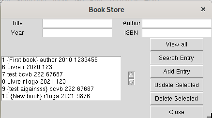

# Book Store database with minimal front end

Store book information:
Title, Author, Year, ISBN

User can:

- View all records
- Search an entry
- Add an entry
- Update entry
- Delete
- Close

## Implementation

- backend: [sqlite3](https://docs.python.org/3/library/sqlite3.html)
- frontend/client: [tkinter](https://docs.python.org/3/library/tkinter.html)
